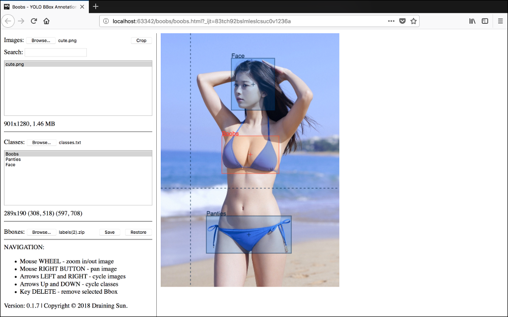

# Boobs - YOLO BBox Annotation Tool
Fast and efficient BBox annotation for your images in YOLO, and now, VOC/COCO formats!

## INTRO
To see why and for what this was created, please read [Boobs - YOLO BBox Annotation Tool](https://medium.com/@drainingsun/boobs-yolo-bbox-annotation-tool-96fb765d0036)

## USAGE
1. Download the zip.
2. Extract it.
3. Open `boobs.html` in your browser.
4. Load images and classes and start bboxing!

## CONFIGURATION
1. Open boobs.js.
2. Edit section named `parameters`.

## COMPATIBILITY
All browsers that support ES6 should work. Tested with:

* Chrome v65
* Firefox v58
* Safari v11
* Opera v51

No idea about IE/Edge.

## FEATURES
* **NEW! Basic Pascal VOC and COCO format support.**
* Works in your browser on any platform.
* Complete YOLO format support.
* No need for image upload - everything is done locally!
* Zooming and panning images with guidelines for precise bboxing.
* Fast navigation for quick bboxing.
* Auto save in memory in case of accidental refreshes and crashes.
* Ability to crop your bboxes and save the resulting images.
* Information on both image and current bbox.

## CAVEATS
* Loading many and or big images might take a while. This is because tool needs to figure out image dimensions.  
* Cropping many items might crash your browser. This and above will be fixed at some point.

## CONTRIBUTING
Go nuts! Just don't forget to follow eslint guidelines. Credit will be given where it's due.